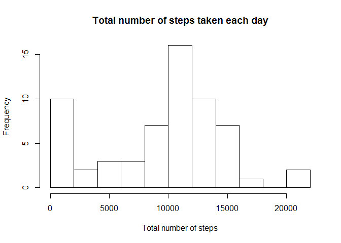
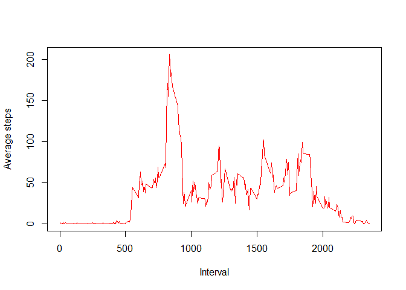
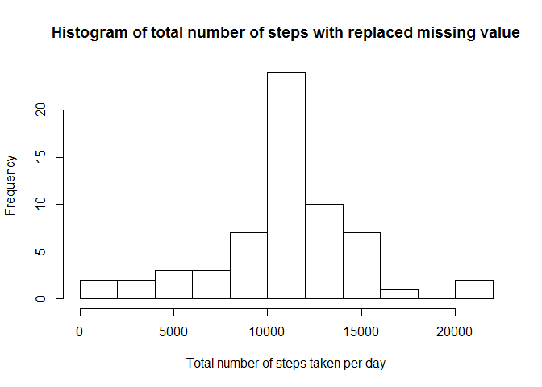
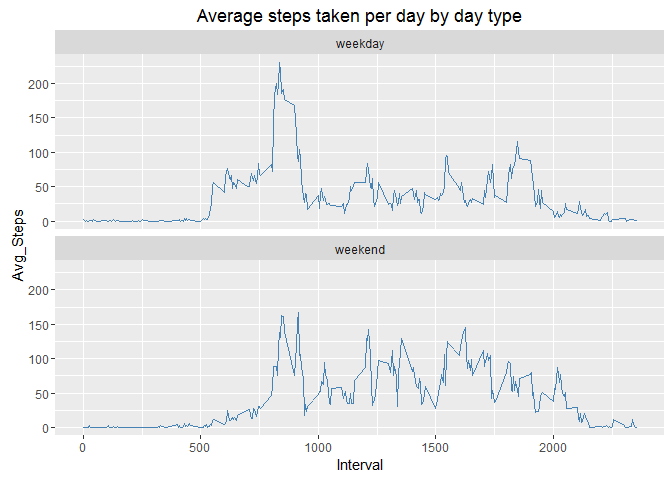

# Reproducible Research: Peer Assessment 1


## Loading and preprocessing the data

This step will load the activity data and Transform data/time format for further analysis.

```r
activityData <- read.csv(unzip("activity.zip", "activity.csv"), na.strings = "NA")
activityData$date <- as.Date(activityData$date)
```


## What is mean total number of steps taken per day?

- Calculate and report the mean and median of the total number of steps taken per day.

```r
totalStep <- aggregate(activityData$steps, list(activityData$date), sum, na.rm = TRUE)
names(totalStep) <- c("Date", "Steps")
mean(totalStep$Steps, na.rm = TRUE)
```

```
## [1] 9354.23
```

```r
median(totalStep$Steps, na.rm = TRUE)
```

```
## [1] 10395
```
The mean total number of steps taken per day is 9354.23 and the median is 10395.

- Make a histogram of the total number of steps taken each day

```r
hist(totalStep$Steps, breaks = 10, main = "Total number of steps taken each day", xlab = "Total number of steps")
```

 

## What is the average daily activity pattern?

- Make a time series plot (i.e. type = "l") of the 5-minute interval (x-axis) and the average number of steps taken, averaged across all days (y-axis)

```r
averageStep <- aggregate(activityData$steps, list(activityData$interval), mean, na.rm = TRUE)
names(averageStep) <- c("Interval", "Avg_Steps")
plot(averageStep$Interval, averageStep$Avg_Steps, type = "l", col = "red", xlab = "Interval", ylab = "Average steps")
```

 

- Which 5-minute interval, on average across all the days in the dataset, contains the maximum number of steps?

```r
averageStep$Interval[which.max(averageStep$Avg_Steps)]
```

```
## [1] 835
```
The 835th interval contains the maximum number of steps.

## Imputing missing values

- Calculate and report the total number of missing values in the dataset (i.e. the total number of rows with NAs)

```r
missingvalue <- is.na(activityData$steps)
sum(missingvalue)
```

```
## [1] 2304
```
There are 2304 missing values in the dataset.

- Create a new dataset that is equal to the original dataset but with the missing data filled in.
Here I devise a strategy for filling in all of the missing values in the dataset. I use the mean for that 5-minute interval to replace the missing value.

```r
replacedData <- merge(activityData, averageStep, by.x = "interval",by.y = "Interval")
NA_replace <- function(x,y){
        if(is.na(x)){

                return(y)
        }
        return(x)
}
replacedData$New_steps <- mapply(NA_replace, replacedData$steps, replacedData$Avg_Steps)
replacedData <- replacedData[with(replacedData, order(date, interval)),]
```

- Make a histogram of the total number of steps taken each day and Calculate and report the mean and median total number of steps taken per day.

```r
totalStep_replaced <- aggregate(replacedData$New_steps, list(replacedData$date), sum)
names(totalStep_replaced) <- c("Date", "Steps")
hist(totalStep_replaced$Steps, breaks = 10, xlab = "Total number of steps taken per day", main = "Histogram of total number of steps with replaced missing value")
```

 

```r
mean(totalStep_replaced$Steps)
```

```
## [1] 10766.19
```

```r
median(totalStep_replaced$Steps)
```

```
## [1] 10766.19
```
These values differ from the estimates from the first part of assignment.
By imputing missing data, the mean and medium are larger and getting closer.

## Are there differences in activity patterns between weekdays and weekends?

- Create a new factor variable in the dataset with two levels - "weekday" and "weekend" indicating whether a given date is a weekday or weekend day.

```r
daytype <- function(date) {
    if (weekdays(date) %in% c("Saturday", "Sunday")) {
        "weekend"
    } else {
        "weekday"
    }
}
replacedData$daytype <- as.factor(sapply(replacedData$date, daytype))
```

- Make a panel plot containing a time series plot (i.e. type = "l") of the 5-minute interval (x-axis) and the average number of steps taken, averaged across all weekday days or weekend days (y-axis).

```r
avg_replacedData <- aggregate(replacedData$New_steps, list(replacedData$interval, replacedData$daytype), mean, na.rm = TRUE)
names(avg_replacedData) <- c("Interval", "DayType", "Avg_Steps")
library(ggplot2)
g <- ggplot(avg_replacedData, aes(Interval, Avg_Steps))
g + geom_line(color = "steelblue") + facet_wrap(~ DayType, nrow = 2) + labs(title = "Average steps taken per day by day type")
```

 
